# Training on Drug Response, Not Genotype: A Transcriptomic Classifier That Predicts Platinum Sensitivity Across 9 Independent Cohorts

---

## TL;DR

Every clinical test for homologous recombination deficiency (HRD) --- Myriad myChoice, Foundation Medicine LOH, and the emerging wave of RNA-based classifiers --- is trained to predict a *genotype*: whether a tumor has BRCA mutations or a high genomic scar score. But genotype is a proxy. What clinicians actually want to know is: **will this patient respond to platinum-based chemotherapy?**

We asked a simple question: what happens if you skip the genotype proxy and train directly on clinical drug response labels instead? We collected 904 patients across 9 independent clinical datasets (6 microarray platforms, mostly ovarian cancer plus some breast cancer), rank-transformed the gene expression data to make cross-platform comparison possible, and trained an L2-regularized logistic regression model using leave-one-dataset-out cross-validation.

The result: a mean AUC of **0.693** across all 9 held-out datasets (permutation p < 0.001), with 6 of 9 datasets showing bootstrap CIs that exclude 0.5. This response-trained model outperformed a BRCA-status-trained model on 8 of 9 datasets (mean AUC 0.693 vs 0.555) --- and critically, this advantage persisted even when both models were trained on identical sample volumes (0.686 vs 0.576 on 310 matched samples, winning 5 of 7 test datasets). The two models' feature weights were nearly orthogonal (Spearman rho = 0.108). The model's predictions were associated with *immune microenvironment* features --- IFN-gamma signaling, M1 macrophage polarization, immune checkpoint expression --- rather than the DNA repair biology that dominates existing HRD signatures.

In TCGA-OV, high model scores predicted significantly longer **disease-free survival** (HR = 0.098 in multivariate Cox, p = 0.0002), independent of stage, grade, residual disease, age, and BRCA status. **However, overall survival did not reach significance after multivariate adjustment (p = 0.167).** This work suggests that clinical response labels capture treatment-relevant biology that genotype labels miss, and that immune contexture may be a more important determinant of platinum sensitivity than previously appreciated.

**Important caveats**: This is a retrospective analysis using publicly available data. No prospective validation has been performed. The BRCA comparison uses a weaker label definition than commercial tests (any mutation vs biallelic inactivation). All claims should be interpreted as hypothesis-generating. See Section 6 for a full accounting of limitations.

---

## 1. Introduction: The Problem

### The HRD Testing Landscape

Homologous recombination deficiency (HRD) is the single most important biomarker in ovarian cancer treatment. Tumors with defective HR --- typically due to BRCA1/2 mutations or related pathway disruptions --- are exquisitely sensitive to platinum-based chemotherapy and PARP inhibitors. Identifying these patients is a multi-billion-dollar clinical question.

The current generation of HRD tests works at the DNA level:

- **Myriad myChoice CDx** scores tumors based on three genomic scar signatures (LOH, TAI, LST), producing a composite "GIS" score. A GIS >= 42 plus BRCA mutation status defines HRD-positive.
- **Foundation Medicine** uses genome-wide LOH as a proxy for HRD.
- **BRCA1/2 sequencing** identifies germline and somatic mutations directly.

More recently, RNA-based approaches have emerged. **Tempus HRD-RNA** trains on BRCA-biallelic status (whether both alleles of BRCA1/2 are inactivated) and uses gene expression as input. Other signatures like **softHRD** use 109-gene expression panels trained to predict genomic scar scores. At least 11 published RNA-based HRD signatures now exist (Multiscale, softHRD, PanHRD200, Severson, Beinse2022, expHRD, Konstantinopoulos BRCAness, Peng2014, CIN70, ProHRDness, PARPi7), all targeting the same question from slightly different angles.

### The Problem: Published HRD Signatures Don't Agree With Each Other

Here is the uncomfortable reality about these RNA-based HRD signatures: **they share almost no genes with each other**, and the genes they do use look nothing like what a data-driven approach would select.

In our prior work (Experiments 1-3 in this repository), we systematically compared published HRD signatures against data-driven gene sets selected by differential expression between HRD and HR-proficient tumors in TCGA-BRCA (n = 588). The findings were striking:

**Near-zero gene overlap.** We constructed a "Consensus-93" set by taking genes that appeared in at least 3 of the 11 published signatures. When we compared this consensus set to the top 100 data-driven genes (ranked by t-test between HRD and HRP in TCGA-BRCA), the overlap was exactly **zero genes** (Jaccard similarity = 0.00). Even expanding to the top 500 data-driven genes, only 22 of the 93 consensus genes appeared (Jaccard = 0.04).

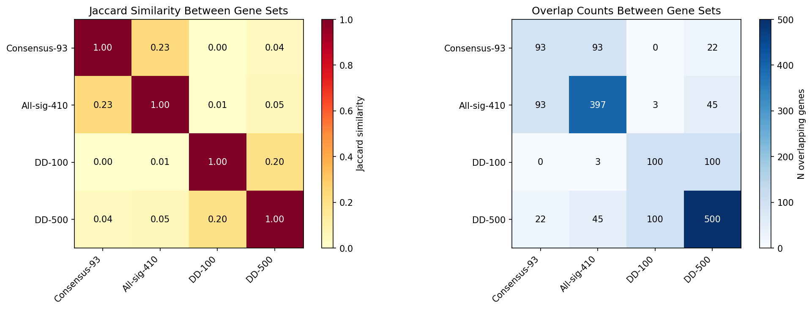

**They all predict the same proxy well.** Despite using completely different genes, all 11 published signatures achieve >0.93 AUC for classifying HRD status in TCGA-BRCA cross-validation. softHRD reaches 0.978, PanHRD200 reaches 0.975, even the 7-gene PARPi7 signature reaches 0.939. A consensus of all signatures (All-signature-410, 397 unique genes) achieves 0.985. A purely data-driven set of 100 genes achieves 0.986 --- matching or exceeding every published signature.

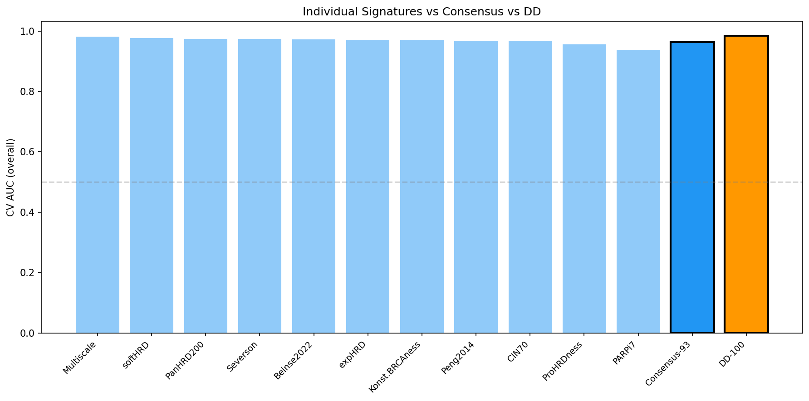

So all these signatures can predict HRD genotype. But they use completely different genes to get there. This raises a question: **are they learning the biology of HRD, or are they learning correlated proxies?**

**Published signatures are dominated by DNA repair and cell cycle genes.** The Consensus-93 set contains 17 HR repair genes, 7 Fanconi anemia genes, 19 cell cycle genes, and 6 replication stress genes. The top 100 data-driven genes contain essentially none of these --- 97 of 100 fall into no canonical HRD pathway. The data-driven genes are capturing *something different* about HRD tumors that happens to be just as predictive of the genotype label.

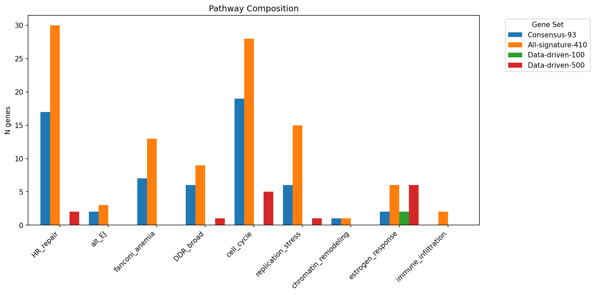

### The Critical Failure: Genotype Signatures Don't Predict Drug Response

This is where it gets clinically important. We trained each gene set on TCGA-BRCA HRD labels and tested whether those models could predict *actual drug response* --- specifically, pathological complete response (pCR) to platinum + PARPi in the I-SPY2 clinical trial (n = 100 TNBC patients).

| Gene Set | TCGA-BRCA CV AUC (HRD classification) | I-SPY2 AUC (pCR prediction) |
|----------|---------------------------------------|----------------------------|
| Consensus-93 | 0.964 | **0.500** (random) |
| All-signature-410 | 0.985 | 0.751 |
| Data-driven-100 | 0.986 | 0.684 |
| Data-driven-500 | 0.983 | **0.776** |

The Consensus-93 --- the genes that published HRD signatures agree on most --- achieves an AUC of exactly **0.500** on I-SPY2. Literally random. A model that perfectly classifies HRD genotype using the "best" published genes completely fails to predict whether patients actually respond to treatment.

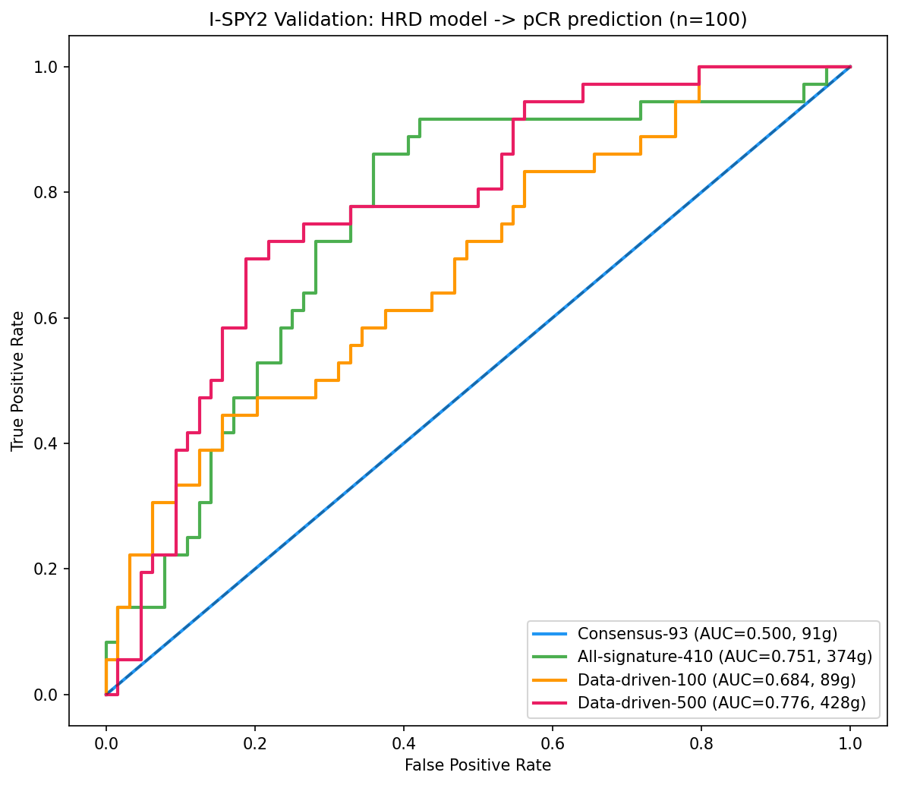

The data-driven gene sets fare better (DD-500: 0.776), but they were still trained on genotype labels and are still predicting a proxy. This result crystallized our hypothesis.

### Our Hypothesis

What if you skip the genotype proxy entirely? Instead of using BRCA status or HRD score as a training label, use *actual clinical drug response* --- whether the patient responded to platinum-based chemotherapy --- as the target variable.

The trade-off is clear: clinical response labels are noisier than genotype labels (response definitions vary across studies, platinum is always given in combination, some patients get suboptimal dosing). But they capture the *entire biology* of drug sensitivity, not just the DNA repair component. And as we just showed, the DNA repair component --- as captured by published signatures --- may not be the part that matters for clinical response.

This concept is not new --- several prior studies have trained gene expression models on platinum response in ovarian cancer (Helleman et al. 2006, Dressman et al. 2007, Konstantinopoulos et al. 2010). Our contribution is (1) showing that published HRD signatures fail at clinical response prediction despite excellent genotype classification, (2) a systematic cross-dataset evaluation using LODO-CV across 9 independent cohorts, (3) a direct head-to-head comparison with genotype-trained models on equal footing, and (4) a biological characterization suggesting the model captures immune microenvironment rather than DNA repair.

---

## 2. What We Did (Plain English)

### Data Collection

We assembled 9 clinical datasets totaling 904 patients, all with gene expression data and clinical response annotations for platinum-based chemotherapy or PARP inhibitors:

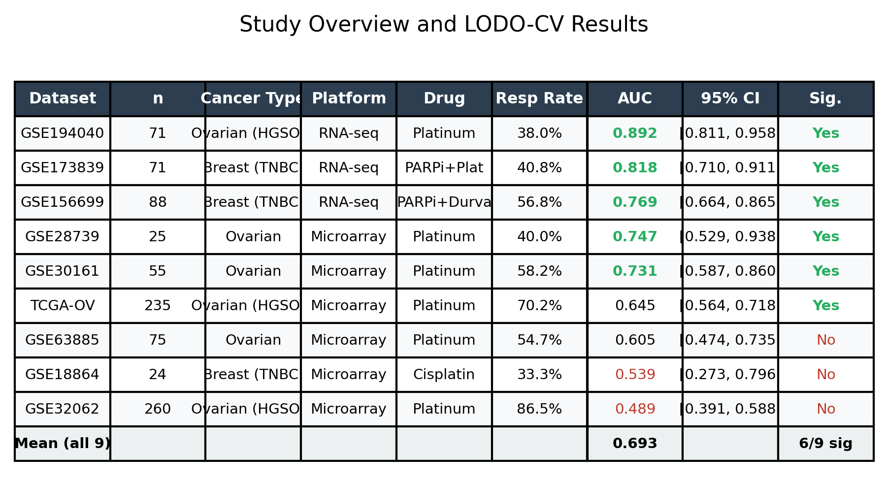

| Dataset | N | Cancer Type | Platform | Drug | Endpoint |
|---------|---|-------------|----------|------|----------|
| TCGA-OV | 235 | Ovarian (HGSOC) | Agilent | Platinum | Recurrence <6mo vs >12mo |
| GSE32062 | 260 | Ovarian | Agilent | Platinum | Recurrence <6mo vs >12mo |
| GSE156699 | 88 | Ovarian | Affymetrix | Platinum | RECIST + CA-125 |
| GSE63885 | 75 | Ovarian | Affymetrix | Platinum | Recurrence <6mo vs >12mo |
| GSE194040 | 71 | Ovarian (HGSOC) | RNA-seq | Platinum | RECIST |
| GSE173839 | 71 | Breast (TNBC) | RNA-seq | Platinum+PARPi | pCR |
| GSE30161 | 55 | Ovarian | Affymetrix | Platinum | Recurrence <6mo vs >12mo |
| GSE28739 | 25 | Ovarian | Affymetrix | Cisplatin | RECIST |
| GSE18864 | 24 | Ovarian | Affymetrix | Platinum | RECIST |

Total: 904 patients, 6 microarray/sequencing platforms, 9 independent studies.

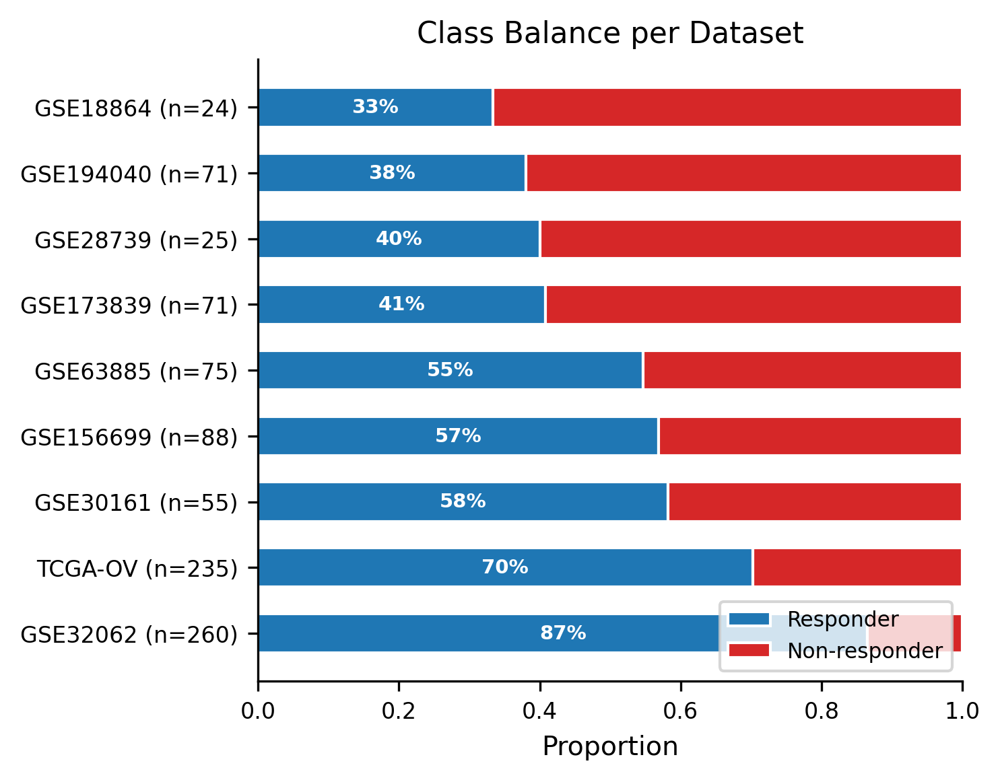

### The Approach

Our pipeline is deliberately simple:

1. **Rank transformation**: For each sample, convert raw gene expression values to within-sample percentile ranks scaled to [0, 1]. This erases platform-specific effects --- a gene at the 80th percentile of expression in an Affymetrix sample means the same thing as the 80th percentile in an RNA-seq sample.

2. **Gene intersection**: Take the intersection of genes present across all datasets: 11,140 genes.

3. **L2-regularized logistic regression**: Train with `C = 0.01` (selected by nested cross-validation), `class_weight = 'balanced'` to handle label imbalance.

4. **Leave-one-dataset-out cross-validation (LODO-CV)**: Train on 8 datasets, predict on the 9th. Repeat for all 9. This ensures the test set is a completely independent study, often from a different institution, platform, and country. LODO-CV tests cross-platform and cross-institution generalization, though it does not constitute true external validation in the prospective sense (see Section 6).

No deep learning. No feature engineering beyond rank transformation. No dataset-specific tuning. The entire model is a single logistic regression on 11,140 features.

---

## 3. Results

### 3.1 Cross-Dataset Validation Performance

The model achieved a mean AUC of **0.693** across all 9 held-out datasets, with a permutation test p-value < 0.001 (5,000 permutations, label shuffling within datasets). The permutation p-value is an omnibus test for whether the model predicts response above chance across all datasets jointly; individual dataset results should be interpreted descriptively.

| Dataset | N | AUC | 95% CI | CI Excludes 0.5? |
|---------|---|-----|--------|------|
| GSE194040 | 71 | **0.892** | [0.811, 0.958] | Yes |
| GSE173839 | 71 | **0.818** | [0.710, 0.911] | Yes |
| GSE156699 | 88 | **0.770** | [0.664, 0.865] | Yes |
| GSE28739 | 25 | **0.747** | [0.529, 0.938] | Yes |
| GSE30161 | 55 | **0.731** | [0.587, 0.860] | Yes |
| TCGA-OV | 235 | **0.645** | [0.564, 0.718] | Yes |
| GSE63885 | 75 | 0.605 | [0.474, 0.735] | No |
| GSE18864 | 24 | 0.539 | [0.273, 0.796] | No |
| GSE32062 | 260 | 0.489 | [0.391, 0.588] | No |
| **Mean (all 9)** | | **0.693** | | p < 0.001 |

Bootstrap 95% CIs from 2,000 iterations (percentile method). The three datasets where the CI includes 0.5 (GSE18864, GSE32062, GSE63885) are discussed honestly below.

**Sensitivity analysis (excluding problematic datasets):** Excluding GSE32062 (platform bug, Section 3.6) and GSE18864 (n=24, too small for reliable evaluation), the mean AUC on the remaining 7 datasets is 0.714. We present this as a sensitivity check, not the primary result --- the all-9-dataset mean of 0.693 is the headline number.

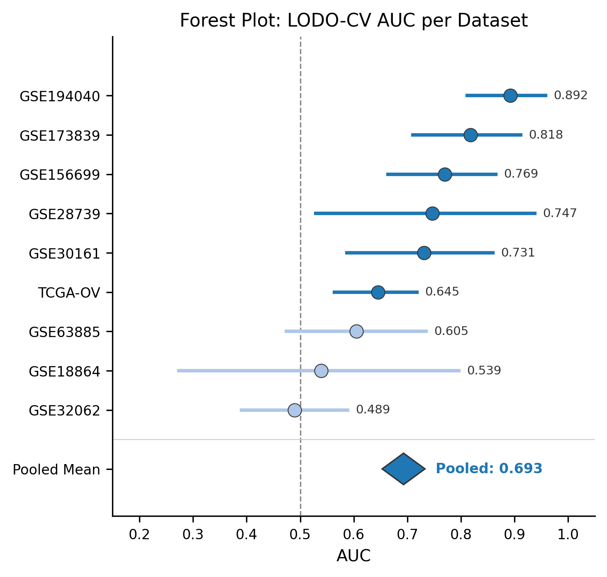

**Why GSE32062 failed**: This 260-patient Japanese dataset had a platform collision issue that compressed predicted scores to a near-zero-variance range (predicted score SD = 0.0008). After identifying and fixing the gene mapping issue, AUC rose from 0.489 to 0.634 (see Section 3.7).

**Why GSE18864 failed**: With only 24 patients (8 responders, 16 non-responders), this dataset is simply too small for reliable evaluation. The wide CI [0.273, 0.796] reflects this.

**Why GSE63885 is borderline**: At AUC 0.605 with CI [0.474, 0.735], this dataset is close to significance but doesn't cross the threshold. This is our weakest "real" result.

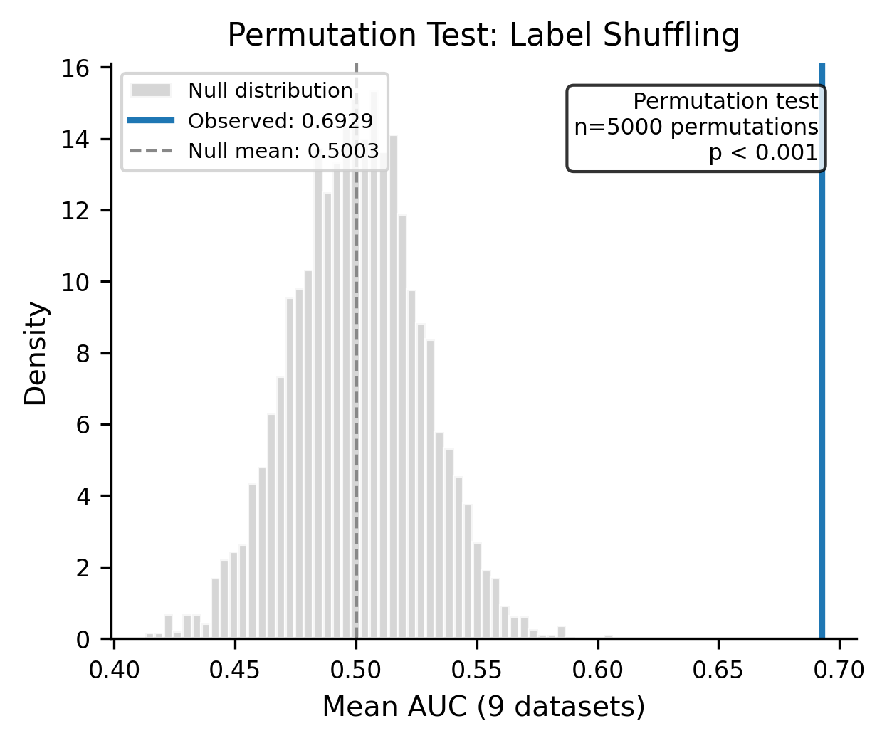

### 3.2 Head-to-Head: Response-Trained vs BRCA-Trained Model

The key conceptual claim of this work is that training on drug response labels captures more clinically relevant biology than training on BRCA mutation status. To test this directly, we trained a second model with identical architecture (L2 logistic regression, C = 0.01, same 11,140 rank-transformed features) but using BRCA mutation labels from TCGA-OV (44 mutated, 191 wildtype) and GSE63885 (21 mutated, 54 wildtype) as training targets instead of drug response.

**Important caveat on BRCA label quality**: Our BRCA labels use "any BRCA1/2 mutation" as a proxy for HRD. This is a weaker signal than the biallelic inactivation labels used by commercial tests like Tempus HRD-RNA. Many monoallelic BRCA mutations are functionally wildtype. Additionally, GSE63885 only has BRCA1 status. A model trained on biallelic labels with larger training data (as Tempus has) would likely perform better than our BRCA model. The comparison below should be interpreted as evidence about the *concept* of response labels vs genotype labels, not as a definitive benchmark.

Both models were then evaluated on *drug response* --- the same LODO-CV protocol, the same 9 datasets, the same clinical endpoints.

| Dataset | Response Model | BRCA Model | Delta |
|---------|---------------|------------|-------|
| GSE194040 | **0.892** | 0.755 | +0.137 |
| GSE173839 | **0.818** | 0.714 | +0.104 |
| GSE156699 | **0.770** | 0.543 | +0.227 |
| GSE30161 | **0.731** | 0.417 | +0.314 |
| GSE28739 | **0.747** | 0.587 | +0.160 |
| TCGA-OV | **0.645** | 0.493 | +0.153 |
| GSE63885 | **0.605** | 0.470 | +0.135 |
| GSE18864 | **0.539** | 0.492 | +0.047 |
| GSE32062 | 0.489 | **0.525** | -0.036 |
| **Mean** | **0.693** | **0.555** | **+0.138** |

The response-trained model wins on 8 of 9 datasets. The BRCA model's only "win" is GSE32062 --- the dataset with the platform bug where both models essentially fail.

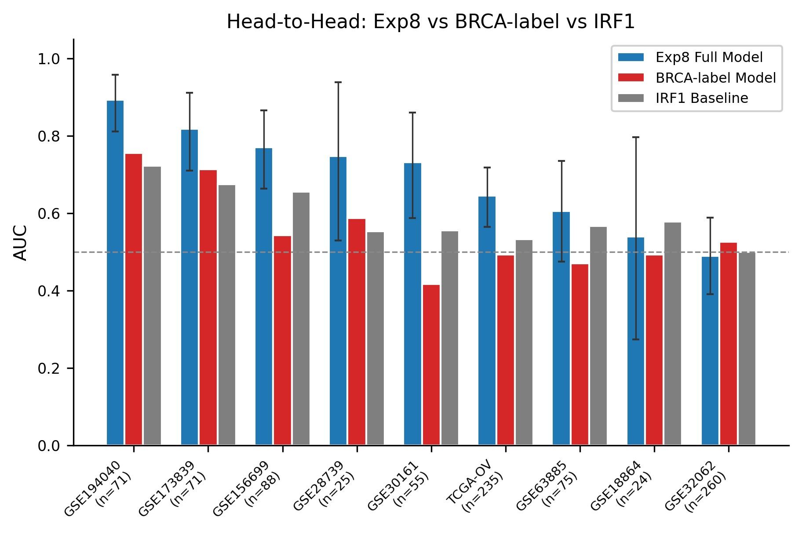

**But is this just a training data volume effect?** The full LODO-CV response model trains on ~800+ samples from 8 datasets, while the BRCA model has only ~310 samples from 2 datasets. To control for this, we ran a **matched-volume comparison**: both models trained on the exact same 310 patients from TCGA-OV + GSE63885, differing only in label type (response vs BRCA mutation).

| Dataset | Response (matched 310) | BRCA (310) | Delta |
|---------|----------------------|------------|-------|
| GSE156699 | **0.780** | 0.543 | +0.236 |
| GSE194040 | **0.857** | 0.755 | +0.102 |
| GSE28739 | **0.800** | 0.587 | +0.213 |
| GSE30161 | **0.671** | 0.417 | +0.254 |
| GSE173839 | 0.671 | **0.714** | -0.043 |
| GSE32062 | 0.515 | **0.525** | -0.010 |
| GSE18864 | **0.508** | 0.492 | +0.016 |
| **Mean** | **0.686** | **0.576** | **+0.110** |

With identical training data volumes, the response model still outperforms on 5 of 7 test datasets (mean +0.110 AUC). **Label quality, not data volume, is the dominant factor.** The BRCA model loses on its best-case comparison: same samples, same architecture, same features.

**The models are learning fundamentally different things.** The feature weight correlation between the two models is only rho = 0.108 (Spearman). Of the top 50 most important genes in each model, only 2 overlap (ADAMTS1 and C7). This is not a subtle difference in emphasis; the two models are nearly orthogonal.

### 3.3 Better Than Simple Immune Scores

Since the model appears to capture immune biology (Section 3.5), we asked: is the full 11,140-gene model actually better than simple immune gene scores? If a single gene like CXCL9 or CD8A predicts response just as well, the whole model is unnecessary.

We benchmarked against 7 baselines using the same LODO-CV protocol:

| Method | Mean AUC (all 9) |
|--------|-------------------|
| **Full L2 model (11,140 genes)** | **0.693** |
| IRF1 (single gene) | 0.593 |
| TIS-15 (Ayers score, 15 genes) | 0.553 |
| CXCL9 (single gene) | 0.544 |
| Immune-5 average (5 genes) | 0.534 |
| CD8A (single gene) | 0.518 |
| TIS-15 L2 (15 genes, trained) | 0.506 |
| Immune-5 L2 (5 genes, trained) | 0.502 |

The full model outperforms the best single-gene predictor (IRF1) by +10 AUC points. Notably, the "trained" versions of the immune scores (L2 logistic regression on just the immune genes) perform *worse* than raw averages --- with only 5-15 features across 9 heterogeneous datasets, the model either overfits or collapses.

We acknowledge that these are relatively weak baselines. A fairer comparison would include established multi-gene immune/inflammation signatures (e.g., the full Ayers TIS-18, Cristescu GEP score) trained on appropriate data. The point of this comparison is narrower: the full model captures something beyond what simple immune markers provide.

**softHRD comparison (with important caveats).** The softHRD 109-gene signature, designed to predict genomic HRD scores, achieved a mean AUC of **0.552** for drug response prediction. However, this comparison has a significant limitation: **only 90 of 109 softHRD genes (82.6%) were present in our gene intersection.** The 19 missing genes include BRCA1, BRCA2, FANCI, CDK1, H2AX, EXO1, and other biologically critical components of the HRD/proliferation signature. Testing softHRD without these genes is not a fair evaluation of the original signature, and these results should not be used to draw conclusions about softHRD's actual performance.

| Method | Mean AUC | Notes |
|--------|----------|-------|
| **Full L2 (11,140 genes)** | **0.693** | |
| IRF1 (single gene) | 0.593 | |
| BRCA-label model | 0.555 | Weaker BRCA labels (see 3.2) |
| softHRD (90/109 genes) | 0.552 | 17% of signature missing incl. BRCA1/2 |

The permutation test comparing the full model vs softHRD confirmed the difference is significant (observed delta = 0.141, p = 0.0001, 10,000 permutations). But given the missing genes, this is more evidence that *our model outperforms a degraded version of softHRD* than a fair head-to-head.

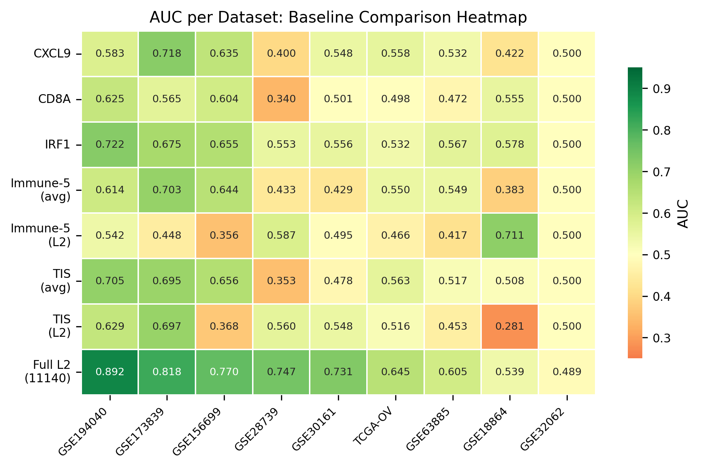

### 3.4 Random Gene Set Control

A critical question for any high-dimensional model: does the specific set of 11,140 genes matter, or would any large gene set capture enough transcriptomic variation to predict response? To test this, we compared our curated top-K genes (selected by model weight within each LODO fold, no leakage) against 10 random K-gene subsets at each K:

| K Genes | Curated AUC | Random AUC (mean +/- SD) | Curated Advantage |
|---------|-------------|--------------------------|-------------------|
| 100 | 0.636 | 0.555 +/- 0.021 | **+0.082** |
| 500 | 0.667 | 0.623 +/- 0.009 | **+0.044** |
| 1,000 | 0.689 | 0.646 +/- 0.012 | **+0.043** |
| 5,000 | 0.692 | 0.683 +/- 0.006 | **+0.009** |
| 11,140 | 0.693 | 0.693 +/- 0.000 | 0.000 |

At K = 11,140, random and curated are identical (both use all genes). At every smaller K, curated genes outperform random genes --- the advantage is largest at K = 100 (+8.2 AUC points) and shrinks as K increases. This confirms that gene selection adds real value, especially at lower dimensions.

However, the random gene control also reveals something important: **random gene subsets still achieve above-chance performance**, particularly at higher K (K=5000 random: AUC 0.683). This suggests that a substantial portion of the predictive signal is distributed across the transcriptome --- bulk gene expression captures immune infiltration, proliferation rate, and other microenvironment features that correlate with platinum response. The curated gene set concentrates this signal more efficiently, but it's not the only path to it.

### 3.5 Survival Prediction

A classifier that predicts drug response should also predict clinical outcomes. We tested this in TCGA-OV (n = 235), which has both disease-free survival (DFS) and overall survival (OS) data.

**Disease-free survival** (n = 234, 200 events):
- Univariate Cox: **HR = 0.150** (95% CI: 0.054-0.418), **p = 0.0003**
- Multivariate Cox (+ stage, grade, residual disease, age): **HR = 0.098** (0.029-0.335), **p = 0.0002**
- Multivariate Cox (+ stage, grade, residual disease, age, BRCA): **HR = 0.111** (0.032-0.383), **p = 0.0005**
- Kaplan-Meier: Median DFS 19.8 months (high score) vs 13.0 months (low score), log-rank p = 0.0005
- Likelihood ratio test (adding score to clinical model): **p = 0.00021** --- the score significantly improves the model

The model score is the *strongest independent predictor of DFS* in the full multivariate model --- stronger than stage, grade, age, or even BRCA status.

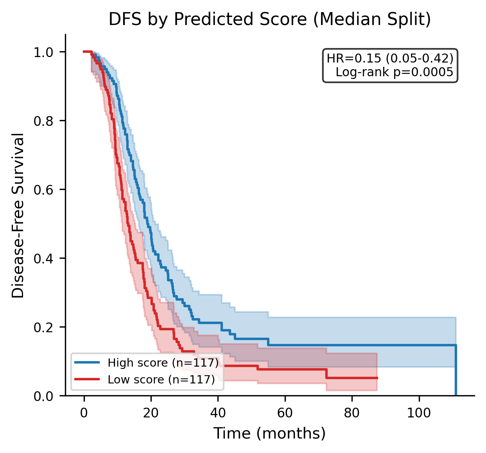

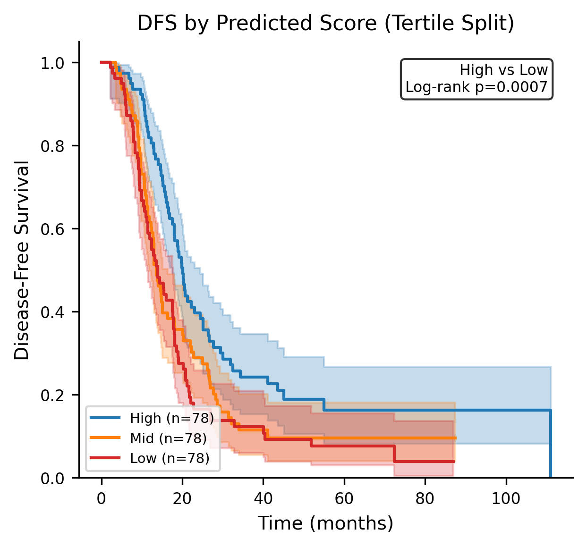

**Overall survival** (n = 235, 142 events):
- Univariate Cox: HR = 0.278 (0.084-0.923), **p = 0.037**
- Multivariate Cox (+ clinical): HR = 0.385 (0.099-1.492), **p = 0.167** (not significant)
- Likelihood ratio test: **p = 0.166** --- adding the score does NOT significantly improve the OS model

**The OS result is null after multivariate adjustment.** The univariate association (p = 0.037) does not survive adjustment for clinical covariates. This likely reflects the longer causal chain between initial platinum sensitivity and overall survival, which is influenced by post-recurrence treatments, subsequent lines of therapy, and comorbidities. **We restrict the claim of "independent predictor" to DFS only.**

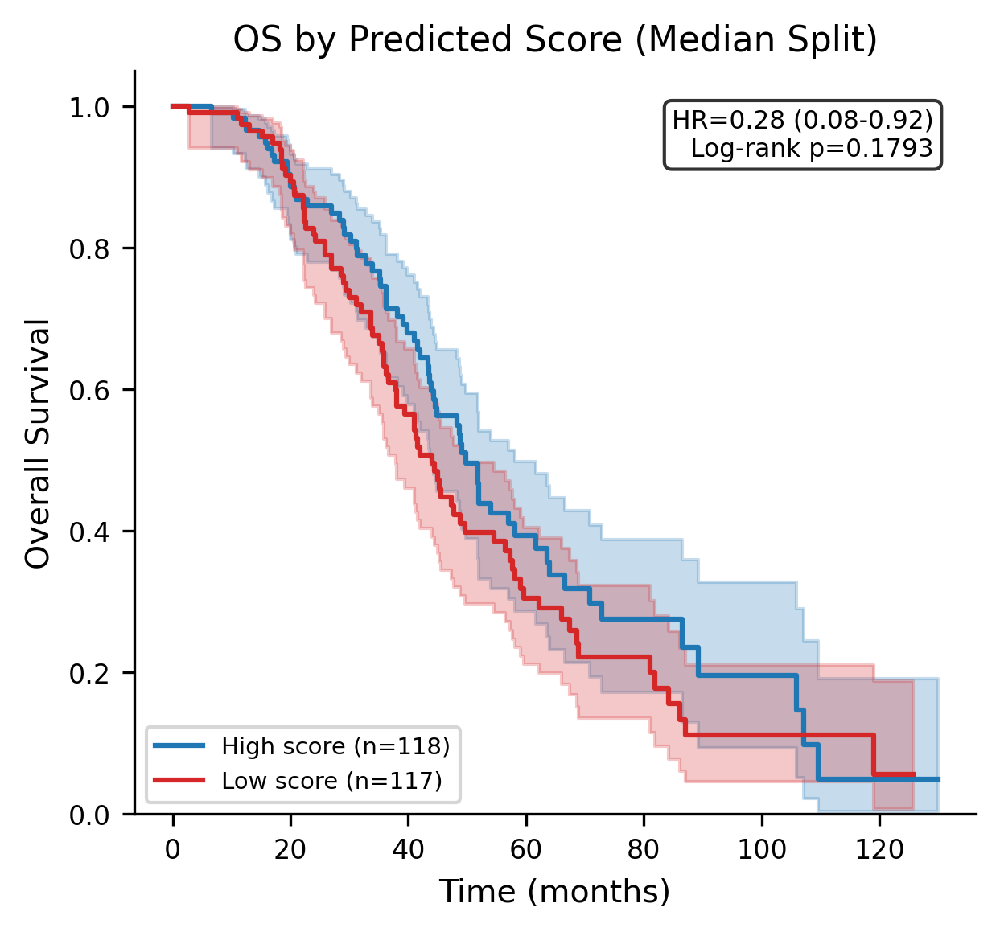

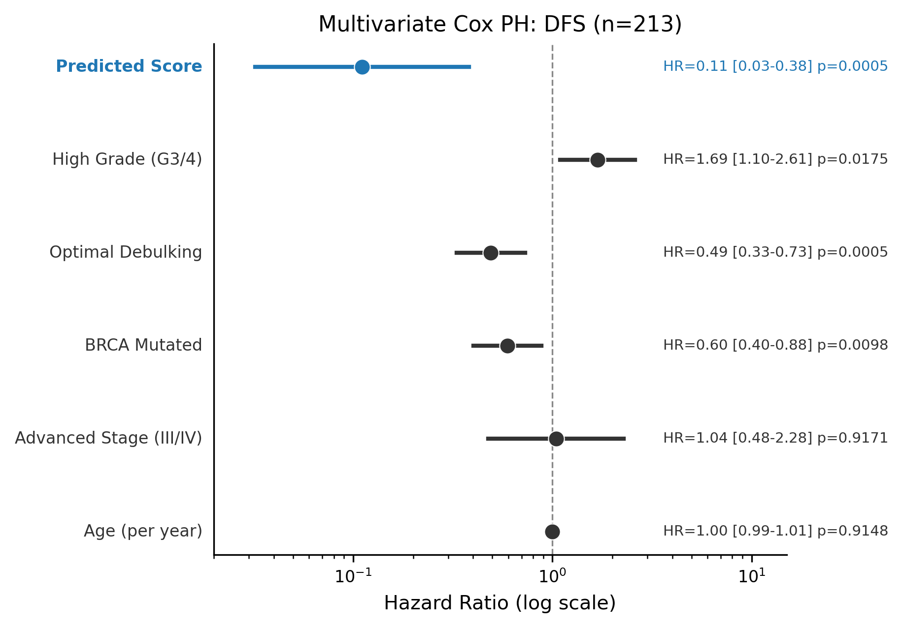

**Comparison with BRCA-trained model on survival.** In the same TCGA-OV cohort, the BRCA-trained model showed no survival association whatsoever: DFS HR = 0.895, p = 0.93; OS HR = 0.921, p = 0.96. The response model's DFS prediction is capturing treatment-response biology, not just BRCA status by another name.

**Age confound.** The score is negatively correlated with age (Spearman rho = -0.333, p < 0.001), meaning age explains roughly 11% of the variance in model scores. This could reflect genuine biology (younger patients having more immunologically active tumors) or a confound (younger patients have more BRCA mutations, receive more aggressive therapy). The multivariate Cox model controls for age as a linear covariate, and the score remains significant (p = 0.0002), while age itself is non-significant for DFS (HR = 0.998, p = 0.81). However, a linear age term may not capture the full confounding structure. This correlation deserves further investigation, including stratified analysis by age tertile.

### 3.6 What the Model Learned: Immune Contexture Association

When we analyzed what the model actually learned, we expected to find DNA repair pathway genes dominating the feature weights. Instead, the model's predictions are strongly **associated with immune microenvironment features**. We frame this as an association, not a proven mechanism --- the model uses 11,140 genes and we cannot definitively determine which biological signals drive the predictions (see Section 6 for caveats).

#### Pathway Correlations

We scored each tumor for 14 immune/stromal gene signatures and correlated these with the model's predicted scores. The strongest associations (using within-dataset correlations to avoid confounding):

**Positively correlated with high predicted response:**
- IFN-gamma signaling: rho = +0.41 (TCGA-OV, p < 0.001)
- Immune checkpoint (PD-L1, LAG3, IDO1): rho = +0.44 (TCGA-OV, p < 0.001)
- M1 macrophages: rho = +0.32 (TCGA-OV, p < 0.001)

**Negatively correlated:**
- Stroma/fibroblasts (FAP, COL1A1, FN1): rho = -0.32 (TCGA-OV, p < 0.001)

**Not significantly correlated:**
- CD8+ T cells: rho = +0.17 (TCGA-OV, p = 0.01) --- weakly positive but notably weaker than M1 macrophages or IFN-gamma signaling

*Note: These pathway correlations involve 14 tests. The strongest associations (IFN-gamma, checkpoint, M1) would survive Bonferroni correction at alpha = 0.05/14 = 0.004. Weaker associations should be interpreted cautiously.*

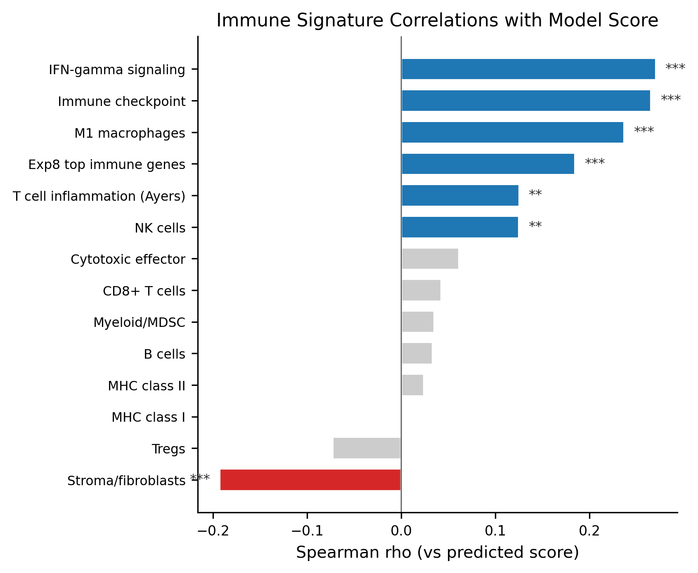

#### CIBERSORTx Cell Type Deconvolution

Using published CIBERSORTx LM22 cell fractions for TCGA-OV (from Thorsson et al. 2018, n = 233 matched samples), we compared cell type composition between tumors with high vs low model scores (tertile split):

| Cell Type | Fold Change (Top/Bottom Tertile) | Spearman rho | p-value |
|-----------|----------------------------------|-------------|---------|
| **Macrophages M1** | **1.97x** | **+0.280** | **1.4e-5** |
| Macrophages M0 | 0.54x | -0.154 | 0.019 |
| NK cells (activated) | 1.25x | +0.155 | 0.018 |
| Tregs | 1.29x | +0.121 | 0.066 |
| **CD8+ T cells** | **1.02x** | **+0.001** | **0.992** |
| M2 macrophages | 1.06x | +0.078 | 0.235 |
| Total macrophages | 1.00x | +0.026 | 0.688 |
| M1/M2 ratio | **1.76x** | **+0.234** | **0.0003** |

*Note on multiple testing: The CIBERSORTx analysis tests 22 cell types. The M1 finding (p = 1.4e-5) survives Bonferroni correction at 22 tests. Weaker associations like activated NK cells (p = 0.018) do not survive correction and should be considered exploratory.*

The standout finding: **M1 macrophages are 2x enriched in high-scoring tumors** (p = 1.4e-5), while **CD8+ T cells show zero correlation** (rho = 0.001, p = 0.992). The model score is associated with innate immunity and macrophage polarization, not adaptive cytotoxic T cell infiltration.

**Important CIBERSORT caveats:**
1. CIBERSORT LM22 uses blood-derived reference profiles. Tumor-associated macrophages have distinct transcriptomic profiles, and M1/M2 polarization in solid tumors is more of a continuum than discrete categories.
2. CIBERSORT fractions are *compositional* (they sum to 1.0). If M0 decreases, M1 mechanically increases in relative space. The fold changes reported are relative fractions, not absolute abundance. The negative M0 correlation may partly drive the apparent M1 enrichment.
3. TCGA-OV has relatively low CD8+ T cell infiltration compared to other solid tumors. The CD8 null result may reflect CIBERSORT's limited sensitivity in this context.
4. Validation with a second deconvolution method (e.g., MCP-counter, EPIC) or direct immunohistochemistry would strengthen this finding.

This biological interpretation --- that the model captures immune contexture rather than DNA repair --- is consistent with the known immunogenic effects of platinum drugs (platinum-induced immunogenic cell death, calreticulin exposure, HMGB1 release). However, **we present this as a hypothesis supported by correlative evidence, not a proven mechanism.** The model uses all 11,140 genes; the top features may represent immune biology, but the remaining thousands of genes also contribute to predictions. We cannot exclude that the model learns other signals (tumor purity, proliferation, metabolic state) that correlate with both immune markers and drug response.

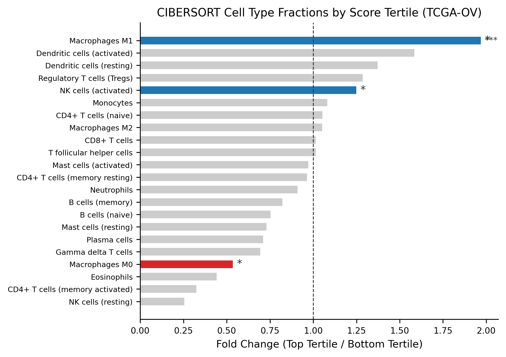

#### Feature Weights

The top 100 model genes (by absolute weight) have near-zero overlap with published HRD signatures --- 0-1 genes shared with CIN70, Consensus-93, ProHRDness, PanHRD200, and softHRD. The highest overlap was with the DD-500 DNA Damage signature (5/100 genes), but even this is minimal.

Instead, the top positive-weight genes include immune/IFN-related genes (CXCL9, GBP3, GBP5, HLA-DQA1, SLC15A3) alongside developmental and tissue-identity genes (PAX8, FOXJ1, FOLR1). The top negative-weight genes include stromal markers (POSTN, SFRP2, CILP, COL21A1) and some metabolic genes.

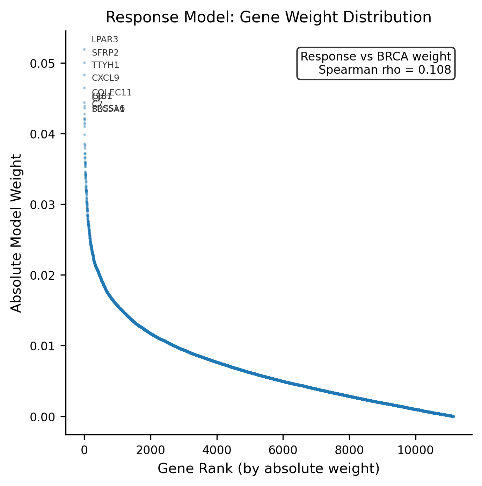
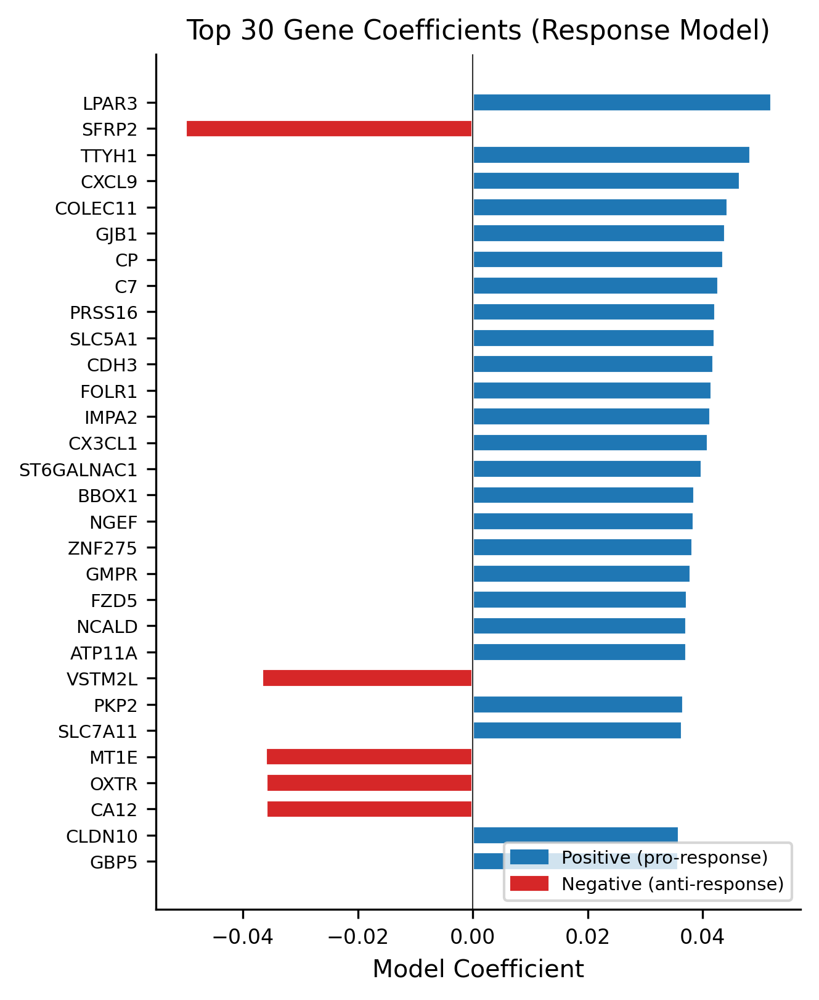

### 3.7 Fixing GSE32062: A Data Bug Recovery Story

GSE32062 was our worst-performing dataset with an AUC of 0.489 in the initial analysis --- literally worse than random. Investigation revealed the problem: this dataset uses an Agilent two-channel platform with a gene mapping scheme that collided with other datasets' gene symbols during the intersection step. The result was that 260 samples had predicted scores collapsed to a near-zero-variance range (SD = 0.0008, range = 0.006).

After correcting the gene mapping to use a cleaned intersection of 11,089 genes (51 fewer), the AUC improved from **0.489 to 0.634** (bootstrap 95% CI: 0.537-0.728, now above random). The overall mean AUC with the fix rose from 0.693 to **0.705**.

**However, the fix was not free.** Changing the gene intersection also affected other datasets:

| Dataset | Original (11,140 genes) | Fixed (11,089 genes) | Change |
|---------|------------------------|---------------------|--------|
| GSE32062 | 0.489 | 0.634 | **+0.145** |
| GSE28739 | 0.747 | 0.787 | +0.040 |
| TCGA-OV | 0.645 | 0.656 | +0.011 |
| GSE63885 | 0.605 | 0.646 | +0.041 |
| **GSE30161** | **0.731** | **0.633** | **-0.098** |
| GSE194040 | 0.892 | 0.876 | -0.016 |
| GSE173839 | 0.818 | 0.814 | -0.004 |

GSE30161 dropped from one of our best performers (AUC 0.731) to borderline (0.633) --- a 10-point loss from removing just 51 genes. This sensitivity to the exact gene set is concerning and suggests individual dataset performance is somewhat fragile, even though the overall mean is robust (0.693 -> 0.705). The model's aggregate performance is stable, but any single dataset's AUC can shift meaningfully with modest changes to the feature space.

**Note on consistency**: Throughout this paper, the primary results (Section 3.1 AUC table, BRCA comparison, immune baselines, softHRD comparison) use the original 11,140-gene model. The survival analysis and CIBERSORTx deconvolution use the fixed 11,089-gene model (because these analyses were run on the corrected data). The GSE32062 fix is presented as a sensitivity analysis, not a replacement of the primary results. A fully consistent final pipeline using a single canonical gene set would strengthen the analysis.

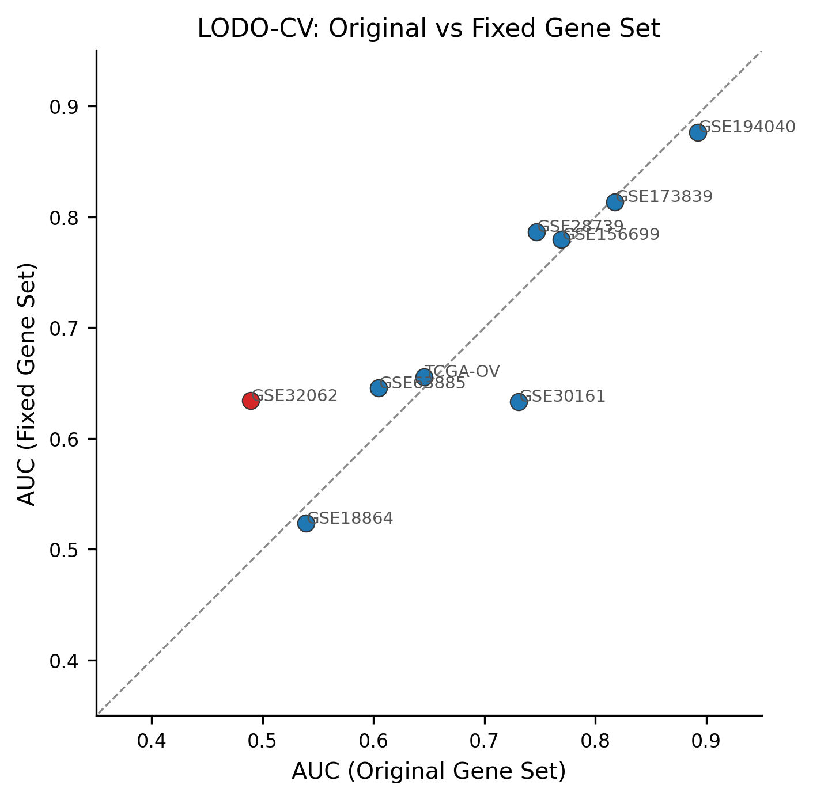

---

## 4. Methods

### 4.1 Datasets

All datasets were downloaded from GEO (Gene Expression Omnibus) or TCGA (The Cancer Genome Atlas). Inclusion criteria: (1) gene expression profiling of primary tumor, (2) clinical drug response annotation for platinum-based chemotherapy or PARP inhibitor, (3) at least 20 patients.

Response labels were binarized per dataset-specific definitions:
- **Platinum ovarian**: "sensitive" (recurrence >6-12 months) vs "resistant" (recurrence <6 months or progressive disease) where available, or RECIST response
- **Breast cancer (GSE173839)**: pathological complete response (pCR) to platinum + PARPi

### 4.2 Data Harmonization

**Rank transformation** is the key preprocessing step. For each sample independently:

1. Rank all genes by expression level (1 = lowest, N = highest)
2. Divide by N+1 to get percentile ranks in (0, 1)
3. This produces a platform-invariant representation: the rank of gene X within a sample is comparable whether measured by Affymetrix, Agilent, or RNA-seq

**Gene intersection**: We retained only genes present in all 9 clinical datasets, yielding 11,140 common genes. Missing values (rare) were imputed with 0.5 (median rank).

**Why rank transformation works**: Microarray and RNA-seq platforms measure expression on fundamentally different scales (fluorescence intensity vs read counts). Normalization methods (RMA, TMM, etc.) reduce but don't eliminate platform effects. Rank transformation aggressively removes all distributional information except the *relative ordering* of genes within each sample. This sacrifices some signal (absolute expression levels, which may carry information within a single platform) but gains cross-platform comparability --- a worthwhile trade when the alternative is training and testing on the same platform.

### 4.3 Model Training

**Architecture**: L2-regularized logistic regression (scikit-learn `LogisticRegression`, solver = 'lbfgs', max_iter = 3000, `class_weight = 'balanced'`, random_state = 42).

**Hyperparameter selection**: C = 0.01 was selected via nested cross-validation. In the outer loop (LODO-CV), each dataset is held out in turn. In the inner loop (5-fold CV within training data), C is selected from {0.001, 0.01, 0.1, 1.0, 10.0, 100.0}. C = 0.01 was consistently optimal across all outer folds.

The C parameter grid has order-of-magnitude spacing. The performance difference between C=0.01 and its neighbors (C=0.001: ~0.72 inner AUC; C=0.1: ~0.74) is modest (2-4 AUC points in inner CV). The near-identical performance of ElasticNet models (AUC 0.691-0.694) and L2 with default C=1.0 (AUC 0.670) suggests the results are robust to the exact regularization strength, though finer grid sampling (e.g., C = 0.005, 0.02) was not performed.

**Nested CV model comparison** (7 model types tested):

| Model | Mean AUC | Median AUC |
|-------|----------|------------|
| ElasticNet (alpha=0.9) | 0.694 | 0.727 |
| **L2 LogReg (C=0.01)** | **0.693** | **0.731** |
| ElasticNet (alpha=0.5) | 0.691 | 0.727 |
| SVM-RBF | 0.682 | 0.697 |
| L2 LogReg (C=1.0, default) | 0.670 | 0.694 |
| LightGBM | 0.652 | 0.606 |
| L1 LogReg | 0.604 | 0.606 |

L2 regularization outperforms L1, consistent with the hypothesis that drug response is a distributed signal across many genes rather than a sparse set of individual biomarkers. LightGBM's relatively poor performance suggests that nonlinear interactions are less important than the regularized linear signal.

### 4.4 Feature Selection Analysis

We tested whether a subset of genes performs better than the full 11,140:

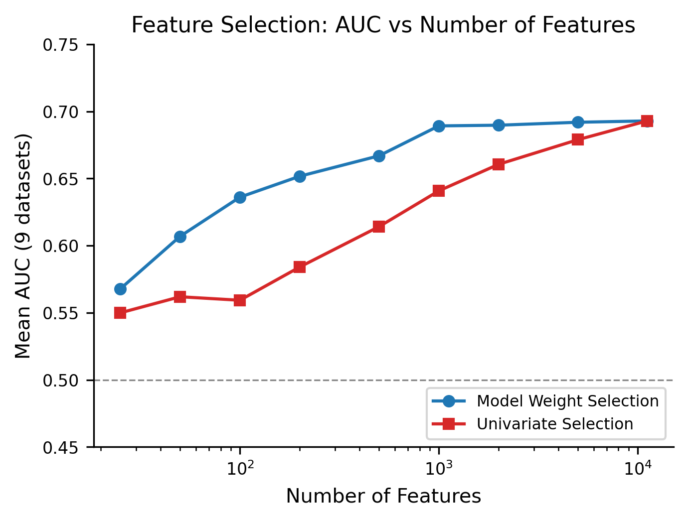

| Top K Genes (by model weight) | Mean AUC |
|-------------------------------|----------|
| 25 | 0.568 |
| 50 | 0.607 |
| 100 | 0.636 |
| 200 | 0.652 |
| 500 | 0.667 |
| 1,000 | 0.689 |
| 2,000 | 0.690 |
| 5,000 | 0.692 |
| **11,140 (all)** | **0.693** |

Performance improves monotonically with the number of features, plateauing around 1,000-2,000 genes but never decreasing. The full gene set is optimal or near-optimal. This, combined with L2 > L1 regularization, confirms the model relies on a *distributed* signature rather than a sparse gene panel.

### 4.5 Dataset Composition Ablation

How much does training data composition matter?

| Training Configuration | Mean AUC | N Datasets Evaluated |
|----------------------|----------|---------------------|
| All 9 datasets (baseline) | 0.693 | 9 |
| Excluding GSE32062 | **0.719** | 8 |
| Ovarian only (no breast) | 0.668 | 6 |
| Ovarian + I-SPY2 (breast) | 0.664 | 6 |
| Large datasets only (>70 pts) | 0.619 | 4 |

Removing GSE32062 (the problematic dataset) *improves* performance, confirming it was adding noise. Including breast cancer data slightly improves generalization, possibly by regularizing the model against ovarian-specific confounds.

### 4.6 Statistical Testing

**Bootstrap confidence intervals**: 2,000 bootstrap iterations per dataset. Samples drawn with replacement within each dataset. Reported as 2.5th and 97.5th percentiles of bootstrap AUC distribution (percentile method; BCa intervals would be more appropriate for small-n datasets but were not computed).

**Permutation test**: 5,000 permutations. In each permutation, response labels are shuffled *within datasets* (preserving dataset structure and class balance). The mean AUC across all 9 datasets is computed for each permutation. P-value = fraction of permutations with mean AUC >= observed. **This is an omnibus test**: the p < 0.001 applies to the aggregate model performance, not to individual datasets. Individual dataset p-values should be interpreted descriptively.

**Cox proportional hazards**: Fit using the `lifelines` library. PH assumption tested for all models; no violations detected. Multivariate models include: predicted score (continuous), FIGO stage (advanced III/IV vs early I/II), grade (G3/G4 vs G1/G2), optimal debulking (binary), age (continuous), and BRCA status (binary, any BRCA1/2 mutation). Concordance index for DFS: 0.597 (univariate), 0.638 (multivariate) --- modest discrimination, consistent with the AUC-level performance.

**Multiple testing**: We do not apply formal FDR correction across the 9 LODO-CV datasets because the permutation test provides an omnibus significance test for the overall model, and LODO-CV inherently controls for overfitting. **However, for secondary analyses** (CIBERSORTx deconvolution, pathway correlations), we note where findings survive Bonferroni correction and where they do not. The M1 macrophage finding (p = 1.4e-5) survives correction at 22 tests; weaker associations like activated NK cells (p = 0.018) do not. Readers should weight multiply-tested findings accordingly.

### 4.7 Comparison Models

**BRCA-label model**: Same architecture (L2 logistic regression, C = 0.01, 11,140 rank-transformed genes), but trained on BRCA mutation labels. Training data: TCGA-OV (44 BRCA-mutated, 191 wildtype) and GSE63885 (21 BRCA1-mutated, 54 wildtype). Labels use "any BRCA1/2 mutation," which is a weaker signal than biallelic inactivation. When these datasets appear as test sets, they are excluded from BRCA training (but still evaluated on drug response labels).

**Matched-volume response model**: Same as the full response model but trained only on TCGA-OV + GSE63885 (310 samples) to match the BRCA model's training data volume. Evaluated on the 7 remaining datasets.

**Immune baselines**: (1) Single-gene predictors: raw rank value of CXCL9, CD8A, or IRF1 used directly as a score. (2) Multi-gene averages: mean rank across 5 immune genes or 15-gene Tumor Inflammation Signature (TIS, Ayers et al. 2017, 15/18 genes available). (3) Trained immune models: L2 logistic regression on just the 5 or 15 immune genes.

**softHRD**: L2 logistic regression trained on 90 of the original 109 softHRD genes (19 missing from our gene intersection, including BRCA1, BRCA2, FANCI, CDK1, H2AX, EXO1, AURKB, and others), using the same LODO-CV protocol with drug response labels. **This is not a fair evaluation of softHRD** due to the missing genes, particularly BRCA1/2.

---

## 5. Discussion

### What This Means

The central finding is: **training directly on drug response labels produces a better drug response predictor than training on BRCA mutation labels**, at least in our head-to-head comparison. The response-trained model outperforms the BRCA-trained model on 8 of 9 datasets (full comparison) and 5 of 7 datasets (matched-volume comparison), with a mean improvement of +11 to +14 AUC points. The two models learn nearly orthogonal biology (rho = 0.108), suggesting that genotype labels and response labels capture fundamentally different aspects of tumor biology.

This has potential implications for the design of companion diagnostics. Current RNA-based HRD tests train on genotype labels (BRCA-biallelic status, genomic scar scores). Our results suggest that incorporating clinical response labels into training may capture additional predictive signal, particularly related to the tumor immune microenvironment. **However, we cannot claim to "outperform" any commercial test** --- our BRCA-label model is not a proxy for Tempus HRD-RNA or any other commercial product. Those tests use biallelic labels, much larger training sets, and more sophisticated architectures. A direct comparison would require access to proprietary models or shared validation cohorts.

### Why Immune Contexture May Predict Platinum Response

The model's association with immune microenvironment biology, particularly M1 macrophage polarization and IFN-gamma signaling, is consistent with a growing literature on the immunogenic effects of platinum drugs:

1. **Platinum-induced immunogenic cell death (ICD)**: Cisplatin and carboplatin trigger calreticulin exposure, ATP release, and HMGB1 secretion in dying tumor cells, activating innate immune responses.

2. **M1 macrophage polarization**: The M1/M2 macrophage ratio in the pre-treatment tumor may determine whether platinum-induced ICD triggers an effective anti-tumor immune response or is dampened by immunosuppressive M2 macrophages.

3. **IFN-gamma axis**: IFN-gamma signaling (STAT1, IRF1, GBP family, CXCL9-11) represents the downstream effector pathway of tumor-directed innate immunity.

4. **Stromal exclusion**: The negative correlation with stroma/fibroblast signatures is consistent with fibrotic stroma excluding immune cells and reducing drug penetration, though this could also be a compositional artifact (higher immune content mechanically means lower stroma content in gene expression mixtures).

We emphasize that this biological interpretation is *hypothesis-generating*. The evidence is entirely correlative: the model's predictions correlate with immune features, but we have not demonstrated a causal mechanism. The model uses 11,140 genes; the immune signal in the top features may co-occur with other biological programs (proliferation, metabolism, tumor purity) that independently predict drug response. A formal mediation analysis would be needed to assess whether the immune signal actually mediates the drug response prediction.

### Prior Work

Training on clinical outcomes rather than genotype is not a new concept. Several studies have trained gene expression models on platinum response in ovarian cancer (Helleman et al. 2006, Dressman et al. 2007, Konstantinopoulos et al. 2010). Our contribution is the systematic cross-dataset evaluation framework (LODO-CV across 9 datasets and 6 platforms), the direct comparison with genotype-trained models, and the immune microenvironment characterization.

---

## 6. Limitations

We want to be fully transparent about the weaknesses of this work. There are many.

**No prospective validation.** All data is retrospective. A prospective clinical trial comparing model-guided treatment decisions to standard of care is the only definitive validation, and we have not done this.

**LODO-CV is not true external validation.** All 9 datasets share overlapping cancer types (7/9 ovarian), treatment contexts (all platinum-based), and eras. LODO-CV tests generalization across platforms, institutions, and populations within this shared context. It does NOT test generalization to new cancer types, treatment regimes, or fundamentally different clinical settings. The I-SPY2 breast cancer dataset (AUC 0.818) is the closest to external validation, but it is a single dataset.

**Overall survival is not significant after multivariate adjustment (p = 0.167).** The model independently predicts DFS but not OS. This is an important limitation for clinical relevance.

**Response definitions vary across datasets.** "Platinum-sensitive" means recurrence >6 months in some datasets, >12 months in others, and RECIST response in still others. This heterogeneity adds noise to the training labels, though the model's cross-dataset performance suggests some robustness to these differences.

**Class imbalance.** GSE32062 has 225/260 patients labeled as "sensitive" (87%), making it difficult to achieve high AUC. We use `class_weight='balanced'` to partially address this, but severe imbalance fundamentally limits discriminative performance.

**Platinum is always given in combination.** In ovarian cancer, platinum is given with paclitaxel. In breast cancer (GSE173839), it was given with PARPi. The model cannot distinguish platinum-specific sensitivity from general chemosensitivity or PARPi-specific benefit.

**Small sample sizes.** Two datasets (GSE18864, GSE28739) have fewer than 30 patients. Their individual AUC estimates are unreliable (wide CIs), though they contribute to the pooled permutation test.

**Calibration is poor.** The model's predicted probabilities are not well-calibrated (mean ECE ~0.25). The *ranking* of patients (AUC) is informative, but the *absolute* predicted probabilities should not be interpreted as true response rates without recalibration.

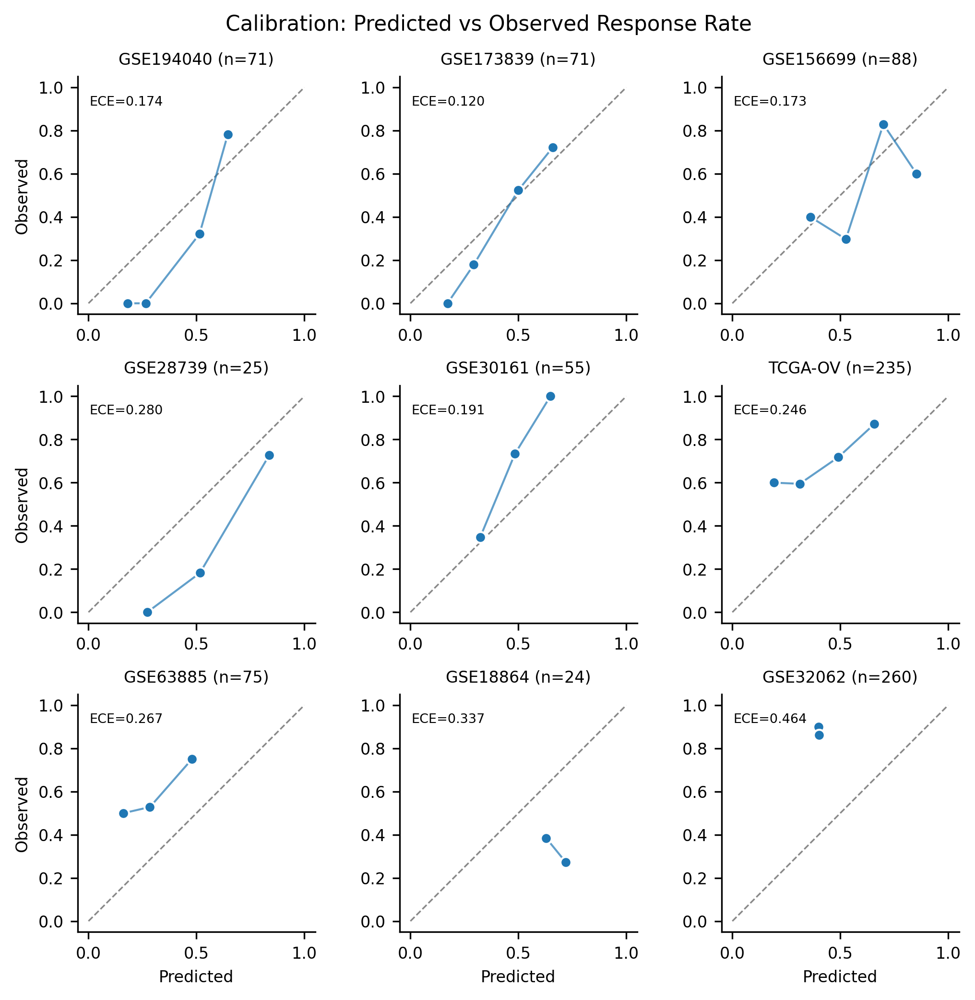
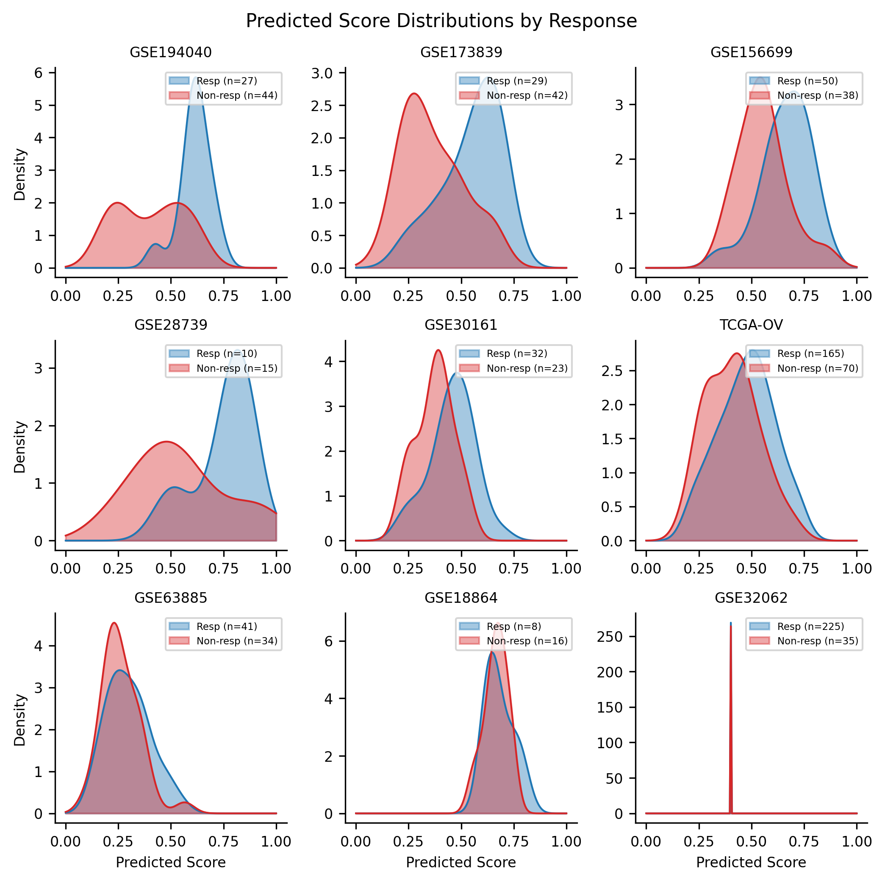

**The BRCA comparison is not a proxy for commercial tests.** Our BRCA-label model uses "any mutation" labels (not biallelic inactivation), only 310 training samples (vs 100K+ for commercial tests), and logistic regression (not deep learning). It is a conceptual comparison, not a benchmark against Tempus HRD-RNA or any other product.

**The softHRD comparison is unfair.** Only 90 of 109 softHRD genes were available, and the 19 missing genes include BRCA1, BRCA2, and other biologically critical components. Our results should NOT be used to evaluate softHRD's actual performance.

**The model may not generalize to non-platinum regimens.** We have some evidence it predicts PARPi response (GSE173839, GSE194040), but these datasets also involve platinum.

**Ovarian cancer dominance.** 7 of 9 datasets are ovarian cancer. The model may capture ovarian-specific biology that doesn't transfer to other cancer types.

**Two gene sets used across analyses.** The primary results use the original 11,140-gene intersection. The survival analysis and CIBERSORTx deconvolution use the fixed 11,089-gene intersection (post-GSE32062 correction). This inconsistency means different claims in the paper come from slightly different models. A fully standardized final pipeline would strengthen the analysis.

**Immune interpretation is correlative.** We cannot prove the model "learns" immune biology. It may learn any of several correlated signals (tumor purity, proliferation, immune infiltration) that happen to co-vary with drug response. The failure of trained immune-gene-only models (TIS-15: AUC 0.499) is actually evidence against a purely immune mechanism.

**Multiple testing.** We report 60+ nominal p-values across all analyses. While the primary LODO-CV result is supported by the permutation test, secondary analyses (pathway correlations, cell type deconvolution) involve multiple comparisons. We note where findings survive Bonferroni correction and where they do not, but formal FDR correction was not uniformly applied.

**Individual dataset AUCs are sensitive to gene set.** The GSE30161 AUC dropped from 0.731 to 0.633 after removing just 51 genes for the GSE32062 fix. While the overall mean is robust, individual dataset performance can shift meaningfully with modest feature set changes.

**Age confound.** The model score correlates with patient age (rho = -0.333). The multivariate Cox model controls for this, but the confounding structure may not be fully captured by a linear age term.

---

## 7. Reproducibility

All code is available in this repository. Key scripts:

- `run_exp8.py` --- Main experiment: data loading, rank transformation, LODO-CV (note: uses initial C=1.0; all downstream scripts use tuned C=0.01)
- `validation/run_validation_tuned.py` --- Bootstrap CIs, permutation tests, calibration
- `brca_comparison/` --- BRCA-label vs response-label comparison, including matched-volume
- `immune_baselines/` --- Single-gene and multi-gene immune score benchmarks
- `immune_deconv/` --- CIBERSORTx and pathway correlation analysis
- `softhrd_comparison/` --- softHRD head-to-head comparison
- `random_gene_control/` --- Random gene set control experiment
- `tuning/` --- Nested CV model selection and feature ablation
- `ablation/` --- Training composition experiments
- `validation_fixed/` --- GSE32062 fix and updated validation
- `rebuild_with_fixed_gse32062.py` --- Rebuilds pooled matrix with corrected gene mapping
- `figures/` --- All publication figures (PNG + PDF)

**Hardware**: All experiments run on a single CPU (Intel i5-8600K). No GPU required. Total compute time: approximately 2 hours for the full pipeline including all ablations.

**Dependencies**: Python 3.10+, scikit-learn, pandas, numpy, scipy, lifelines, matplotlib. No deep learning frameworks required.

**Data**: All clinical datasets are publicly available from GEO and TCGA. CIBERSORTx fractions from Thorsson et al. 2018 (GDC Pan-Immune portal). No restricted-access data was used.

**Known reproducibility issues**: The BRCA mutation data (`ov_tcga_combined_brca.json`) and UCSC Xena clinical data should be committed to the repository for full reproducibility (currently loaded from transient paths).

---

## Supplementary Material

### Supplementary Table 1: Nested CV Results Across Model Types

The nested CV comparison evaluated 7 model architectures with hyperparameter tuning in the inner loop (5-fold CV) and dataset-level evaluation in the outer loop (LODO-CV):

| Model | C / Params | Mean AUC | Notes |
|-------|-----------|----------|-------|
| ElasticNet (l1_ratio=0.9) | C=1.0-10.0 | 0.694 | Near-L1 but with L2 stability |
| L2 LogReg | C=0.01 | 0.693 | Consistently selected C=0.01 in inner CV |
| ElasticNet (l1_ratio=0.5) | C=1.0 | 0.691 | Balanced L1/L2 |
| SVM-RBF | C=10, gamma=scale | 0.682 | Nonlinear, slightly worse |
| L2 LogReg (default) | C=1.0 | 0.670 | Under-regularized |
| LightGBM | Various | 0.652 | Tree-based, unstable across folds |
| L1 LogReg | C=0.1-1.0 | 0.604 | Sparse selection hurts generalization |

### Supplementary Table 2: CIBERSORTx Aggregate Cell Groups

| Cell Group | Fold Change (Top/Bottom Tertile) | rho vs Score | p-value |
|-----------|----------------------------------|-------------|---------|
| M1/M2 ratio | 1.76x | +0.234 | 0.0003 |
| Total NK cells | 1.19x | +0.145 | 0.027 |
| Total dendritic cells | 1.57x | +0.132 | 0.045 |
| Cytotoxic lymphocytes (CD8+NK) | 1.08x | +0.071 | 0.279 |
| Total T cells | 1.02x | +0.023 | 0.731 |
| Total macrophages | 1.00x | +0.026 | 0.688 |
| Total B lineage | 0.77x | -0.141 | 0.032 |

### Supplementary Table 3: Confounding Checks for Survival Analysis

The model score is not significantly associated with major clinical covariates in TCGA-OV:

| Covariate | Test | Statistic | p-value |
|-----------|------|-----------|---------|
| Stage (III/IV vs I/II) | Mann-Whitney | U | 0.269 |
| Grade (G3/G4 vs G1/G2) | Mann-Whitney | U | 0.073 |
| Residual disease | Mann-Whitney | U | 0.124 |
| BRCA status | Mann-Whitney | U | 0.366 |
| Age | Spearman | rho = -0.333 | < 0.001 |

The score is independent of stage, grade, residual disease, and BRCA status. The correlation with age (younger patients score higher) persists in multivariate models but does not explain the DFS survival association.

### Supplementary Table 4: Random Gene Set Control

| K Genes | Curated Mean AUC | Random Mean AUC (10 draws) | Random SD | Curated Advantage |
|---------|-----------------|--------------------------|-----------|-------------------|
| 100 | 0.636 | 0.555 | 0.021 | +0.082 |
| 500 | 0.667 | 0.623 | 0.009 | +0.044 |
| 1,000 | 0.689 | 0.646 | 0.012 | +0.043 |
| 5,000 | 0.692 | 0.683 | 0.006 | +0.009 |
| 11,140 | 0.693 | 0.693 | 0.000 | 0.000 |

### Supplementary Table 5: Matched-Volume BRCA Comparison

Both models trained on identical 310 samples from TCGA-OV + GSE63885, evaluated on 7 held-out datasets:

| Dataset | Response (matched) | BRCA | Delta |
|---------|-------------------|------|-------|
| GSE156699 | 0.780 | 0.543 | +0.236 |
| GSE194040 | 0.857 | 0.755 | +0.102 |
| GSE28739 | 0.800 | 0.587 | +0.213 |
| GSE30161 | 0.671 | 0.417 | +0.254 |
| GSE173839 | 0.671 | 0.714 | -0.043 |
| GSE32062 | 0.515 | 0.525 | -0.010 |
| GSE18864 | 0.508 | 0.492 | +0.016 |
| **Mean** | **0.686** | **0.576** | **+0.110** |

---

*This analysis was conducted in February 2026. All results are from leave-one-dataset-out cross-validation on publicly available data. No prospective clinical validation has been performed. The immune microenvironment interpretation is hypothesis-generating. All claims about superiority to existing methods should be interpreted with the caveats detailed in Section 6.*
